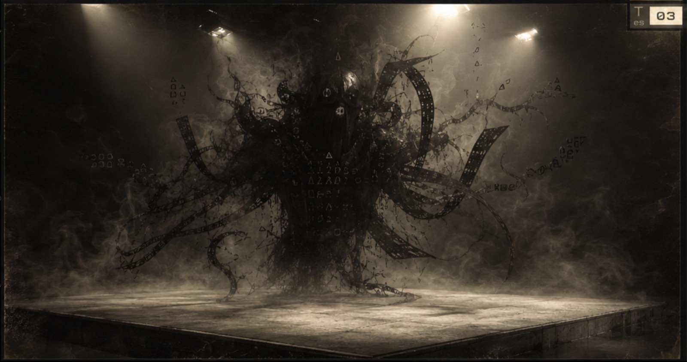

# malbolge-rungs



**Leaderboard: https://oklo.github.io/malbolge-rungs/**

Malbolge — named for the eighth circle of Dante's hell — was designed in 1998 to
be nearly impossible to program. Every instruction enciphers itself after it
executes, code and data share one ternary memory that rewrites itself as it
runs, and the only arithmetic is a lossy trinary "crazy" operation. The first
working program took two years to appear, and it was found by machine search,
not written by hand. That is exactly what makes it a benchmark for frontier
models: there is almost no training data to imitate and no idiom library to lean
on, so producing even a one-byte transform demands first-principles reasoning
about an adversarial machine.

A verification harness, leaderboard, and authoring toolkit for **MAL-51**: a
ladder of classic-Malbolge programming challenges ("rungs") of increasing
difficulty, adjudicated by a single deterministic ground-truth VM.

Malbolge is a deliberately hostile esoteric language: self-modifying code, a
ternary "crazy" operation, and an encryption step applied to every executed
instruction. Writing a program that computes even a one-byte transform is hard.
MAL-51 turns that difficulty into a measurable ladder and asks: *how far up can a
given program — or a given AI model — climb?*

This repo is a clean, self-contained subset of a larger private project. It
contains only the evaluator, the rung registry, the verification harness, the
leaderboard, and the authoring toolkit — none of the surrounding
chain/coin/mining machinery.

Using the rungs as an RL / evaluation substrate — deterministic reward oracle,
procedural instance generation, difficulty knobs, contamination policy — is
documented in **[ENVIRONMENT.md](ENVIRONMENT.md)**.

## What's here

- **`crates/classic_malbolge/`** — the `Classic-Malbolge-51 v0` evaluator, the
  sole ground-truth VM. Pinned semantics in
  [`docs/classic-malbolge-51-v0.md`](docs/classic-malbolge-51-v0.md).
- **`crates/harness/`** — the rung registry, deterministic challenge-case
  derivation, the native verification loop, and the `malbolge-rungs` CLI.
- **`tools/hell_lite/`** — HeLL-Lite, a Python construction/diagnostic toolkit
  for authoring candidate programs. Its Python VM is **diagnostic-only**; the
  native evaluator is the only thing that decides a pass.
- **`leaderboard/leaderboard.json`** — one verification-backed record per rung.
- **`solutions/`** — the actual verified `.mal` programs for solved rungs.
- **`docs/`** — VM semantics and the [challenge registry](docs/challenge-registry.md).

## Quick start

```sh
cargo build
cargo test                       # runs VM conformance tests + re-verifies the leaderboard

# Inspect the ladder
cargo run -p harness -- registry list
cargo run -p harness -- registry show --rung L2.FM1.xor51-map4

# Verify a candidate program against a rung on the native VM
cargo run -p harness -- verify --rung L2.FM1.xor51-map4 \
    --program solutions/fm1/fm1-map4-codex.mal --verbose

# Re-verify every claimed leaderboard solution (CI-style)
cargo run -p harness -- verify-leaderboard

# Render the leaderboard
cargo run -p harness -- leaderboard --render md

# Generate the static leaderboard website (re-verifies every solved rung first)
cargo run -p harness -- site --out _site

# Mint a procedural training instance and verify against it (see ENVIRONMENT.md)
cargo run -p harness -- generate-rung finite-map --k 7 --range low --seed 1234 --out inst.json
cargo run -p harness -- verify --rung-file inst.json --program your-candidate.mal --json

# Score an input set's dispatch feasibility (cheap difficulty estimate)
cargo run -p harness -- feasibility --rung L2.FM2.xor51-map8
```

The [hosted leaderboard](https://oklo.github.io/malbolge-rungs/) is generated by
this same `site` command in CI on every push to `main`. Generation re-runs every
claimed solution on the native VM and fails rather than publish a stale claim,
so the page can never drift from what the evaluator actually confirms.

For convenience the built binary is named `malbolge-rungs`
(`target/debug/malbolge-rungs ...`).

## How verification works

A rung defines a challenge *family*, a per-byte *transform*, a set of *cases*,
and resource limits. To verify a candidate the harness:

1. Derives the rung's cases (input + expected output) — deterministically, so a
   result is reproducible and re-runnable.
2. Runs the candidate program on the **native VM** once per case.
3. Applies the rung's rule:
   - **Non-coverage rungs**: every case must halt and produce the exact expected
     output.
   - **Coverage rungs**: at least `min_correct_cases` of the 256 single-byte
     cases must be correct.

Transform rungs derive their input by hashing (per case, per seed), so a program
must handle an unpredictable input byte — a constant-output overfit does not
pass. Running several epochs (`--epochs N`) verifies across several seeds. See
[`docs/challenge-registry.md`](docs/challenge-registry.md) for the families,
transforms, and the full ladder.

**Ground truth.** Only the native evaluator counts. A leaderboard entry is never
a recorded claim: each `solved` entry ships an actual `.mal` program, and
`verify-leaderboard` re-runs every one of them on the native VM and fails if any
no longer passes.

## Authoring a candidate with HeLL-Lite

HeLL-Lite helps construct source-valid classic-Malbolge programs and offers a
diagnostic Python VM for fast iteration.

```sh
# Synthesize a two-input finite map (02 -> 53, 06 -> 57)
python3 -m tools.hell_lite.cli compile-finite-map --pairs 02:53,06:57 --out /tmp/fm0

# Confirm it on the ground-truth native VM (never trust the Python VM alone)
cargo run -p harness -- verify --rung L2.FM0.xor51-map2 --program /tmp/fm0/candidate.mal
```

See [`tools/hell_lite/README.md`](tools/hell_lite/README.md) and
[`tools/hell_lite/research-notes.md`](tools/hell_lite/research-notes.md).

## Submitting a solution

1. Author a program and verify it natively:
   `malbolge-rungs verify --rung <id> --program <file> --epochs 5`.
2. Drop the `.mal` file under `solutions/<rung>/`.
3. Add/flip its record in `leaderboard/leaderboard.json` to `solved` with the
   program path, solver attribution, and metric.
4. Run `malbolge-rungs verify-leaderboard` — it must pass.

## Leaderboard (snapshot)

Solved rungs (re-verified on the native VM):

| Rung | Solver | Program |
|------|--------|---------|
| `L0.R0.hello-world-genesis` | canonical `QC` (zero-output halt) | `solutions/genesis/halt-no-output.mal` |
| `L0.R1.echo-1-demo` | canonical `ubO` | `solutions/echo/echo-first-byte.mal` |
| `L1.R0.echo-1` | canonical `ubO` | `solutions/echo/echo-first-byte.mal` |
| `L2.R1.reverse-1` | canonical `ubO` (1-byte reverse ≡ identity) | `solutions/echo/echo-first-byte.mal` |
| `L1.R1.echo-2` | HeLL-Lite (tool) | `solutions/echo/echo-2.mal` |
| `L1.R2.echo-4` | HeLL-Lite (tool) | `solutions/echo/echo-4.mal` |
| `L1.R3.echo-2-multicase` | HeLL-Lite (tool) | `solutions/echo/echo-2.mal` |
| `L2.FM0.xor51-map2` | HeLL-Lite (tool) | `solutions/fm0/fm0-map2.mal` |
| `L2.FM1.xor51-map4` | GPT-5.5 (Codex) | `solutions/fm1/fm1-map4-codex.mal` |
| `L2.R0c.crazy-mask-1` | Fable 5 (Claude Code) | `solutions/crazy/crazy-mask-1.mal` |
| `L2.FM1b.xor51-map6` | Fable 5 (Claude Code) | `solutions/map6/map6-two-stage.mal` |
| `L2.FM1c.xor51-map7a` | Fable 5 (Claude Code) | `solutions/map7a/map7a-two-stage.mal` |
| `L2.FM1d.xor51-map7b` | Fable 5 (Claude Code) | `solutions/map7b/map7b-merged-cluster.mal` |
| `L2.FM2.xor51-map8` | Codex (OpenAI) | `solutions/map8/map8-one-split.mal` |

Everything else is **open** (honestly: most of L2 and all of L3–L5 are
unsolved). The general single-byte XOR frontier (`L2.R0.xor-1`) and the map12+
finite maps are genuinely hard and unsolved. Run
`malbolge-rungs leaderboard --render md` for the current full table with notes.

Leaderboard records carry granular, evidence-backed solver attribution (model
name, provider, harness, type) with unknown fields left null rather than
guessed, and an explicit `rank` ordering the ladder easiest → hardest (the
registry's L0–L5 levels are coarse tiers; within-level order is a best-evidence
estimate and revisable).

## Attribution and licensing

- Code and tooling: MIT (see [LICENSE](LICENSE)).
- `solutions/echo/echo-first-byte.mal` — the canonical minimal `ubO` program
  (IN, OUT, HALT).
- `solutions/fm0/fm0-map2.mal` — synthesized by HeLL-Lite (reusing its
  codex-007 finite-map specimen).
- `solutions/fm1/fm1-map4-codex.mal` — authored by Codex in an internal MAL-51
  match; preserved here as a computational artifact (220 bytes).
- `solutions/map8/map8-one-split.mal` — authored by Codex with the reproducible
  bounded [geometry search](research/map8_search.py) (160 canonical bytes); see
  the [attempt report](docs/attempts/2026-08-07-codex-map8.md).

The original 29 rungs in the registry (`crates/harness/registry.json`) are
dumped verbatim from the source MAL-51 project. Difficulty-smoothing rungs
added since (map7a/map7b and the cov36–cov48 coverage steps) are minted in this
repo, are purely additive, and say so in their `purpose` fields; existing rung
ids never change meaning.
